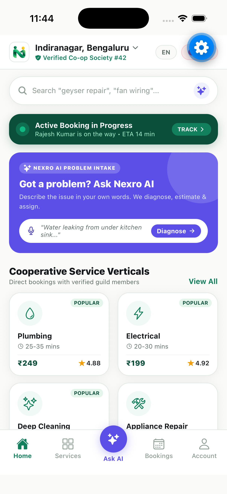
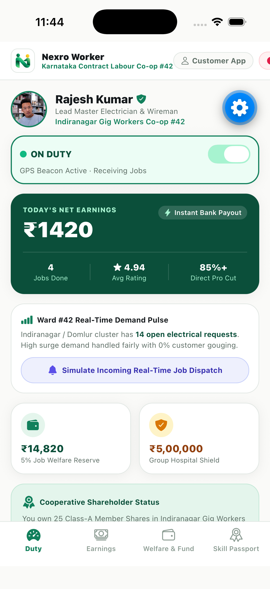
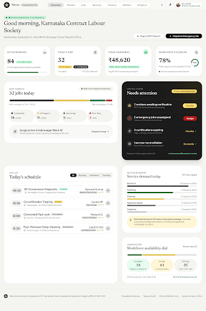
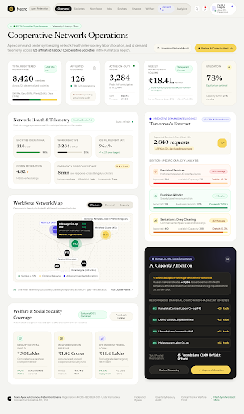
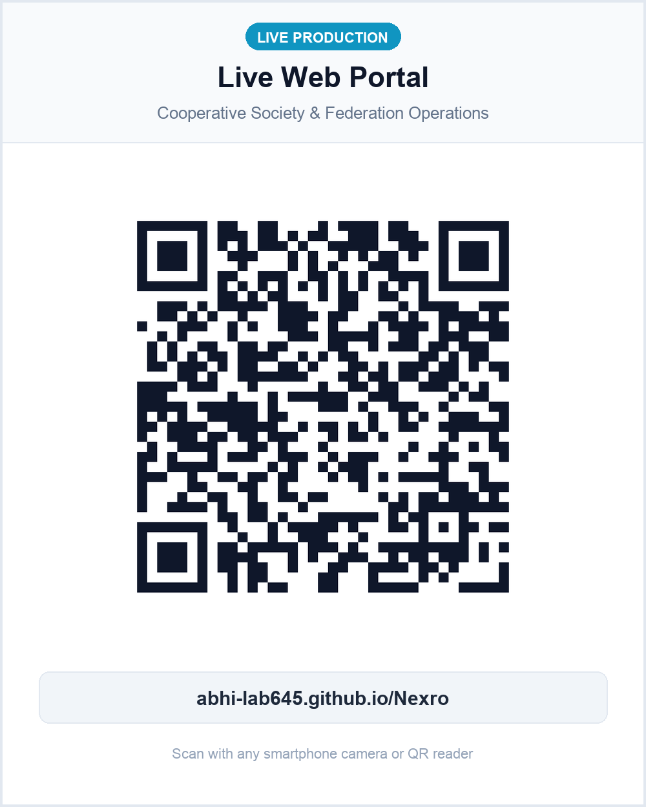
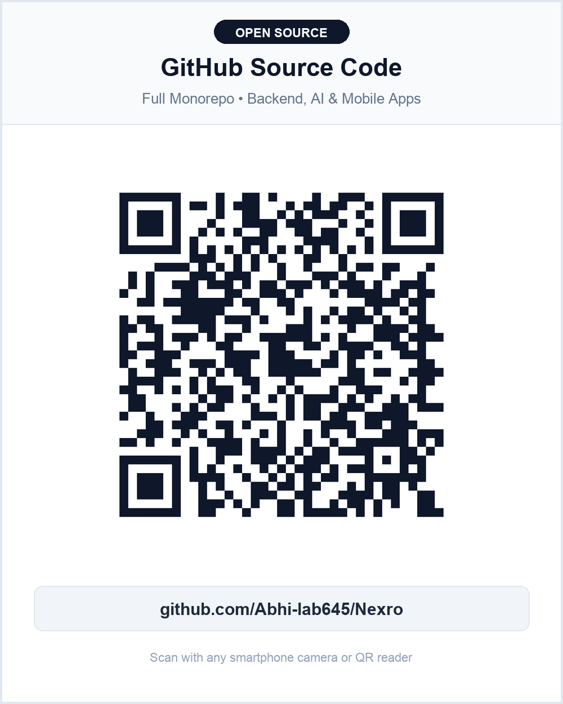

<div align="center">

# NEXRO (ನೆಕ್ಸ್ರೋ)
### Decentralized Labour Cooperative Platform for On-Demand Home Services

[](https://abhi-lab645.github.io/Nexro/)
[](https://github.com/Abhi-lab645/Nexro)

<br/>

[](https://www.postgresql.org/)
[](https://nodejs.org/)
[](https://fastapi.tiangolo.com/)
[](https://expo.dev/)
[](https://vitejs.dev/)
[](LICENSE)

<p align="center">
  <b>Replaces commission-extracting aggregators with primary labour cooperative societies.</b><br/>
  Statutory financial splits (85/5/10), predictive demand rebalancing, real-time dispatch, and worker social security.
</p>

### 🔗 Quick Access
| 🌐 Live Web Portal | 🐙 GitHub Source Code |
| :---: | :---: |
| [**Open Live Application**](https://abhi-lab645.github.io/Nexro/) | [**View Repository**](https://github.com/Abhi-lab645/Nexro) |

</div>

---

## System Overview

Commercial on-demand service aggregators extract **25% to 35%** platform fees per booking while offering zero social security, opaque algorithmic dispatch, and unilateral account deactivations.

**Nexro** is an open cooperative platform that transitions gig workers into registered cooperative shareholders. All transactions run through a PostgreSQL-backed statutory ledger that programmatically guarantees an immutable **85/5/10** settlement split:

* **85% Worker Payout**: Disbursed immediately to the certified worker's account upon two-party OTP completion.
* **5% Social Security & Welfare Fund**: Credited to the worker's cooperative passbook for group hospitalization, emergency loans, and maternity benefits.
* **10% Cooperative Operations**: Retained by the local Ward Cooperative Society to fund tools, training, grievance redressal, and dispute resolution.
* **0% Aggregator Rent-Seeking**: Nexro does not extract predatory per-gig commissions.

---

## Architectural Topology

```
                                  +-------------------------------------------------------+
                                  |                     CLIENT LAYER                      |
                                  +-------------------------------------------------------+
                                       |                             |                 |
                   +-------------------+-------+           +---------+----------+      |
                   |   Consumer Mobile App     |           |  Worker Mobile App |      |
                   | (React Native / Expo 57)  |           | (Expo 57 / Driver) |      |
                   +-------------------+-------+           +---------+----------+      |
                                       |                             |                 |
                                       |  REST / HTTPS               |                 |
                                       |                             |  WebSocket      |
                                       v                             v  (GPS Beacon)   |
+----------------------------------------------------------------------------------+   |
|                         CENTRAL BACKEND GATEWAY (:5001)                          |   |
|  * Express REST API Router                                                       |   |
|  * Real-Time WebSocket Engine (/ws)                                              |   |
|  * Geolocation Proximity & Auto-Dispatch                                         |   |
|  * Two-Party OTP Settlement Engine                                               |   |
|  * Firebase Cloud Messaging Simulation / Push                                    |   |
+----------------------------------------------------------------------------------+   |
         |                                |                                            |
         | Database Pool (pg)             | HTTP RPC                                   |
         v                                v                                            |
+-------------------+           +-----------------------------------------------+      |
|   PostgreSQL 18   |           |         DEMAND AI MICROSERVICE (:8000)        |      |
|    (nexro_db)     |           |          (Python 3.10+ / FastAPI)             |      |
|                   |           +-----------------------------------------------+      |
| * Users & RBAC    |           | * Ward-level Demand Forecaster (Poisson/Ridge)|      |
| * Societies (42)  |           | * Inter-Society Capacity Rebalancer           |      |
| * Certified Pros  |           | * Explainable AI Decision Generator           |      |
| * Bookings Ledger |           +-----------------------------------------------+      |
| * Escrow & Splits |                                  ^                               |
| * Welfare Ledger  |                                  | Telemetry & Plans             |
+-------------------+                                  |                               |
                                                       |                               |
+------------------------------------------------------+-------------------------------+
|             COOPERATIVE & FEDERATION WEB PORTAL (:3000)                              |
|             (React 18 + Vite + TypeScript + Tailwind CSS)                            |
| * Primary Society Console (Indiranagar Co-op #42): Live Dispatches, Payout Ledger    |
| * Federation Apex Console: Multi-Ward Rebalancing, Welfare Pools, Arbitration        |
+--------------------------------------------------------------------------------------+
```

---

## Monorepo Directory Structure

```
Nexrop/
├── nexro-backend/             # Central Node.js Gateway & Statutory Ledger
│   ├── src/
│   │   ├── config/            # DB pool, Firebase Admin init
│   │   ├── db/                # PostgreSQL schema.sql, seed.sql, migrate.js
│   │   ├── middleware/        # JWT auth & RBAC validation
│   │   ├── routes/            # REST endpoints (auth, bookings, societies, workers, ai)
│   │   └── services/          # StatutoryFinanceService, SocketService, NotificationService
│   ├── server.js              # Express app & WebSocket server entry point (:5001)
│   ├── test-backend-suite.js  # 10-step end-to-end integration test suite
│   ├── .env.example           # Backend environment template
│   └── package.json
│
├── nexro-ai-service/          # Predictive Demand & Rebalancing Microservice
│   ├── app/
│   │   ├── api/               # FastAPI endpoints (/ai/predict-demand, /ai/rebalance-plan)
│   │   └── services/          # DemandForecaster, CapacityRebalancer, ExplainableAI
│   ├── main.py                # FastAPI ASGI server entry point (:8000)
│   ├── requirements.txt       # Python dependencies (fastapi, uvicorn, pydantic)
│   └── .env.example           # AI service environment template
│
├── nexro-consumer-app/        # React Native Consumer Mobile App (Port 8081)
│   ├── src/                   # Screens, AI Intake modal, live tracking, payment
│   ├── App.js                 # App root with state machine navigation
│   ├── app.json               # Expo config
│   └── package.json
│
├── nexro-worker-app/          # React Native Certified Worker App (Port 8082)
│   ├── src/                   # On-duty beacon, dispatch alerts, welfare passbook, skill passport
│   ├── App.js                 # Worker duty lifecycle & instant acceptance
│   ├── app.json               # Expo config
│   └── package.json
│
├── nexro-web-portal/          # Cooperative Society & Federation Admin Portal (Port 3000)
│   ├── src/
│   │   ├── components/        # Sidebar, KPI cards, dispatch tables, rebalance drawers
│   │   ├── pages/             # SocietyWorkspace, FederationWorkspace, Analytics
│   │   └── App.tsx            # Portal root with multi-tenant workspace switching
│   ├── vite.config.js         # Vite configuration
│   ├── .env.example           # Web portal environment template
│   └── package.json
│
├── docs/                      # Architectural docs, screenshots, research materials
│   ├── screenshots/           # Live UI screenshots (Consumer, Worker, Dashboards)
│   └── research/              # UI benchmarks, reference specs
│
├── open-backend.sh            # Unified launcher for Node.js + FastAPI
├── open-admin.sh              # Web Portal launcher
├── open-consumer.sh           # Consumer Expo launcher
├── open-worker.sh             # Worker Expo launcher
├── package.json               # Root monorepo workspace scripts
└── .gitignore                 # Strict ignore rules (no .env, no credentials, no artifacts)
```

---

## Product Interfaces

### 1. Consumer Mobile App & Worker Mobile App
Running side-by-side in dual iOS Simulators:

| Consumer Mobile App (Port 8081) | Worker Mobile App (Port 8082) |
| :---: | :---: |
|  |  |
| *Ward-verified booking, AI problem intake, real-time OTP tracking.* | *85% net earnings, on-duty GPS beacon, ₹5L insurance shield.* |

### 2. Cooperative Society & Federation Governance Portals

| Primary Society Workspace (Ward #42) | Federation Apex Governance Console |
| :---: | :---: |
|  |  |
| *Live dispatch monitoring, duty rosters, dispute arbitration.* | *Cross-society workforce rebalancing, welfare reserve audits.* |

> 🌐 **Live Web Application**: The operational portal is hosted and live at **[https://abhi-lab645.github.io/Nexro/](https://abhi-lab645.github.io/Nexro/)**.

---

## 📲 Instant Access & Presentation QR Codes

Scan directly from a mobile device or drag these cards directly into your presentation slides:

<div align="center">

| 🌐 Live Hosted Web Portal | 🐙 GitHub Source Code |
| :---: | :---: |
|  |  |
| [**Open Live Application**](https://abhi-lab645.github.io/Nexro/)<br/>`abhi-lab645.github.io/Nexro` | [**View Source Code**](https://github.com/Abhi-lab645/Nexro)<br/>`github.com/Abhi-lab645/Nexro` |

</div>

---

## Core Financial & Operational Mechanics

### Statutory 85/5/10 Settlement Engine
When a booking is completed, the client transmits the customer OTP to the backend. The settlement engine runs inside an atomic PostgreSQL transaction with row-level locks (`SELECT ... FOR UPDATE`):

```javascript
// Excerpt from nexro-backend/src/services/statutoryFinanceService.js
const total = parseFloat(booking.total_amount);
const workerPayout = parseFloat((total * 0.85).toFixed(2));     // 85% to certified worker
const welfareAmount = parseFloat((total * 0.05).toFixed(2));    // 5% to worker welfare fund
const societyOpsAmount = parseFloat((total * 0.10).toFixed(2)); // 10% to primary cooperative society

// 1. Mark booking completed & record split
await client.query(
  `UPDATE bookings 
   SET status = 'completed', worker_payout = $1, welfare_amount = $2, 
       society_ops_amount = $3, completed_at = NOW() 
   WHERE id = $4`,
  [workerPayout, welfareAmount, societyOpsAmount, bookingId]
);

// 2. Credit worker's cooperative welfare passbook
await client.query(
  `UPDATE workers 
   SET passbook_balance = passbook_balance + $1, total_jobs = total_jobs + 1 
   WHERE id = $2`,
  [welfareAmount, booking.worker_id]
);
```

### Demand Forecasting & Capacity Rebalancing
The Python FastAPI microservice computes hourly demand pressure per ward:

$$\text{Pressure Index} = \frac{\lambda_{\text{predicted}}}{N_{\text{active}} \times \mu_{\text{capacity}}}$$

If a ward exceeds the critical threshold ($\text{Pressure} > 1.25$), the engine evaluates contiguous cooperative societies and issues an automated capacity transfer proposal with an inter-society cooperation incentive (+10% dynamic allowance funded by the federation pool).

---

## Getting Started

### Prerequisites
* **Node.js**: `v20.x` or higher
* **Python**: `3.10` or higher
* **PostgreSQL**: `14.x` to `18.x` running on port `5432`
* **Expo CLI**: `npx expo`

### 1. Clone & Configure Environment

```bash
git clone https://github.com/Abhi-lab645/Nexrop.git
cd Nexrop
```

Copy the example environment files for each service (never commit `.env`):

```bash
# Backend Gateway
cp nexro-backend/.env.example nexro-backend/.env

# AI Microservice
cp nexro-ai-service/.env.example nexro-ai-service/.env

# Web Portal
cp nexro-web-portal/.env.example nexro-web-portal/.env
```

### 2. Database Provisioning & Seeding

Ensure PostgreSQL is running locally, create the database, and execute the migration script:

```bash
# Create PostgreSQL database
createdb nexro_db

# Run schema and seed scripts
npm run backend:migrate
```

The database will be initialized with:
* 5 primary cooperative societies (Indiranagar #42, Koramangala #18, Whitefield #09, Jayanagar #04, HSR #07)
* 4 verified tradesmen with ITI / NSQF certifications and baseline passbook balances
* Seed booking records across all lifecycle states (`in_progress`, `completed`, `assigned`)

### 3. Install Dependencies

Install dependencies across all workspaces:

```bash
# Backend Gateway
cd nexro-backend && npm install && cd ..

# Demand AI Microservice
cd nexro-ai-service
python3 -m venv venv
./venv/bin/pip install -r requirements.txt
cd ..

# Web Portal
cd nexro-web-portal && npm install && cd ..

# Consumer App
cd nexro-consumer-app && npm install && cd ..

# Worker App
cd nexro-worker-app && npm install && cd ..
```

---

## Running the Services

### Option A: Unified Launcher Scripts

You can launch components using the convenience shell scripts:

```bash
# Terminal 1: Backend Gateway (:5001) + FastAPI AI (:8000)
./open-backend.sh

# Terminal 2: Cooperative & Federation Admin Portal (:3000)
./open-admin.sh

# Terminal 3: Consumer Mobile App (:8081)
./open-consumer.sh

# Terminal 4: Worker Mobile App (:8082)
./open-worker.sh
```

### Option B: Monorepo NPM Scripts

```bash
npm run dev:backend   # Starts Node gateway & FastAPI concurrently
npm run dev:admin     # Starts Vite admin portal at http://localhost:3000
npm run dev:consumer  # Starts Consumer Metro bundler on port 8081
npm run dev:worker    # Starts Worker Metro bundler on port 8082
```

---

## Service Matrix & Health Verification

| Subsystem | Port | Protocol | Health / Status Endpoint |
| :--- | :--- | :--- | :--- |
| **Backend Gateway** | `5001` | HTTP / WS | `GET http://localhost:5001/api/health` |
| **Demand AI Service** | `8000` | HTTP | `GET http://localhost:8000/health` |
| **PostgreSQL 18** | `5432` | TCP | `localhost:5432/nexro_db` |
| **Web Admin Portal** | `3000` | HTTP | `http://localhost:3000/` |
| **Consumer App Metro**| `8081` | HTTP / WS | `http://localhost:8081/status` |
| **Worker App Metro** | `8082` | HTTP / WS | `http://localhost:8082/status` |

---

## Automated Test Suite

Run the full end-to-end integration test suite against the live backend and AI services:

```bash
npm run test:backend
```

### Test Coverage (10/10 Passing):
1. Node.js Express Gateway health verification (`GET /api/health`)
2. Python FastAPI Demand AI health verification (`GET /health`)
3. AI Service Proxy & Ward demand forecasting (`POST /api/ai/forecast`)
4. Primary cooperative societies listing (`GET /api/societies`)
5. Certified worker registry with trade credentials (`GET /api/workers`)
6. Real-time booking creation and geofence-based worker assignment (`POST /api/bookings`)
7. WebSocket channel handshake and bidirectional event distribution (`/ws`)
8. Two-party OTP completion validation (`POST /api/bookings/:id/verify-otp`)
9. Atomic statutory settlement execution (Worker: 85%, Welfare: 5%, Co-op: 10%)
10. Cooperative passbook credit balance audit (`GET /api/workers/:id/passbook`)

---

## Testing on Physical Mobile Devices

Both mobile applications can be tested directly on iOS or Android using the **Expo Go** client:

1. Connect your physical smartphone to the same local Wi-Fi network as your development machine.
2. Open Expo Go (Android) or the native Camera app (iOS).
3. Scan the corresponding QR code:

<div align="center">

| Consumer App (`exp://<LAN_IP>:8081`) | Worker App (`exp://<LAN_IP>:8082`) |
| :---: | :---: |
|  |  |

</div>

---

## REST API Specification

### Bookings & Operations
* `POST /api/bookings`: Create booking, lock escrow, and dispatch nearest certified worker.
* `GET /api/bookings/:id`: Retrieve live status, assigned pro location, and OTP state.
* `POST /api/bookings/:id/verify-otp`: Submit customer verification OTP, finalize booking, and trigger atomic 85/5/10 settlement.
* `POST /api/emergency`: Priority dispatch for urgent utility breakdowns (gas, electrical hazards).

### Cooperative Societies & Workers
* `GET /api/societies`: List verified primary cooperative societies and jurisdictional boundaries.
* `GET /api/workers`: Search certified workers filtered by trade, NSQF tier, and availability.
* `GET /api/workers/:id/passbook`: Retrieve social security entries and hospitalization pool balance.

### Demand AI & Governance
* `POST /api/ai/forecast`: Generate predictive demand forecast for a target cooperative ward.
* `POST /api/ai/rebalance`: Request inter-society workforce redistribution schedule.
* `POST /api/ai/explain`: Generate plain-language governance rationale for audit committees.

---

## Security & Privacy Guidelines

* **Never commit `.env` files**: Local database credentials, Firebase service account keys, and JWT secrets must strictly stay local.
* **Statutory Compliance**: The 85/5/10 settlement formula is locked by database-level constraints. Any financial alteration requires multi-signature governance approval recorded in the audit trail.
* **Worker Data Rights**: Worker location beacons are active strictly while toggled **ON DUTY**. Disconnecting or completing shifts immediately terminates background telemetry tracking.

---

## Hosting & Production Deployment

### 1. Live Web Portal (GitHub Pages)
The Cooperative Society & Federation Governance Portal is configured for automated CI/CD deployment via GitHub Actions:
* **Live Deployment URL**: [https://abhi-lab645.github.io/Nexro/](https://abhi-lab645.github.io/Nexro/)
* Workflow definition: [`.github/workflows/deploy-portal.yml`](.github/workflows/deploy-portal.yml)

### 2. Containerized Cloud VPS Deployment (Docker Compose)
For deployment to any cloud virtual machine (AWS EC2, DigitalOcean, Hetzner, GCP):

```bash
# Clone the repository on your server
git clone https://github.com/Abhi-lab645/Nexro.git
cd Nexro

# Spin up all microservices with a single command
docker compose up -d --build
```
Containers include automated health checks, volume persistence for PostgreSQL, and reverse-proxy bindings.

---

## License

This project is licensed under the MIT License — see the [LICENSE](LICENSE) file for details.
